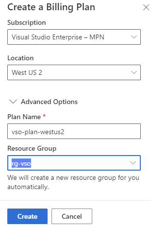
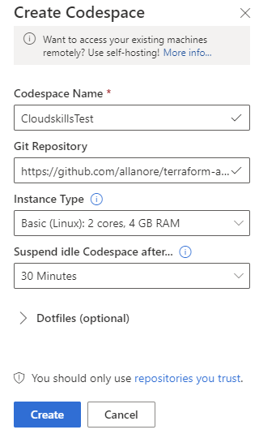
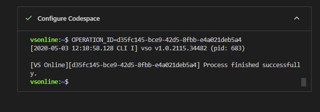

## Module 1: Terraform on Azure: The Big Picture

Benefits of IaC, we gain the following abilities for ALL infrastructure components in code without having to rely on the vendor to "enhance" their product with these features:
- **Transparency** - Living documentation of environment
- **Copy Paste Infrastructure** - Reproducible infrastructure with a copy and paste.
- **Testing** - Infrastructure that is in code can now be tested like software code. 
- **Infrastructure Versioning** - Can now version our code in source control like an application.
- **Change Auditing** - ANY change made to infrastructure is tracked and logged.
- **Rollback** - We can now roll back to a previous version of any infrastructure defined in code.


What happens when we use Infrastructure as Code in a team setting?

- **Removes Specialty In Provisioning** - If deploying a SQL server is automated, we no longer need an engineer specialized in SQL to deploy it every time. This task can be handed to other teams, freeing up time.
- **Consistency**- Automated deployments of infrastructure enforce infrastructure to always be deployed with the same configuration, reducing time spent on troubleshooting due to one off configurations.
- **Visibility** - Teams can see each others infrastructure code in one place. No longer need access to the network or security team's equipment to see how something is configured. Just look at their Read-Only access code.

### How to set up VSCodeSpaces

Visual Studio Codespaces is an online version of Visual Studio Code. It allows us to automatically deploy an environment with a code repository so we can dive into Terraform with minimal setup.  

> **Note:** The compute for this service will be hosted in your Azure tenant, so there will be some charges associated. The average cost for a basic environment is around $0.08 per hour. Also, environments can be in a "suspended" and "active" state, which reduces pricing even further. For more information on VSC billing, check out the [pricing page](https://azure.microsoft.com/en-us/pricing/details/visual-studio-online/). 

 
To create the Codespaces environment, navigate to the [Visual Studio Codespaces](https://online.visualstudio.com/login) login page and sign in with your Azure credentials. Make sure to use Google Chrome as FireFox and Edge are not yet supported. Once logged in, we will be presented with the following page below. Select **Create Codespace**:


Next, we need to create a billing plan. The billing plan connects the Visual Studio Codespace environment to our Azure subscription. Select a location that makes sense for you. Also, you can input a plan name according to your Azure naming standards. The plan name is the name of the Azure resource that deploys to your subscription. Next, we need to specify the resource group to host the Visual Studio Codespace resource. When done configuring these settings select **Create**:



Now we can set up our Codespace; this is the Visual Studio environment. We could have multiple Codespaces in our plan if we wanted to. Input a **Codespace Name** for the Codespace. Under **Git Repository** paste in the following GitHub repo:
```
https://github.com/CloudSkills/Terraform-Projects
```
Under **Instance Type**, select the Basic type. Next, select **Create** to build out our VSC environment:



We should see our environment starting to build and the post-create.sh script automatically executes and installs our tools and extensions:
>**Note:** You may need to refresh your browser at some point to get this screen to show up.


Once the **Configure Codespace** section shows complete, we are ready to move on to  reviewing the folder structure of this repository:

